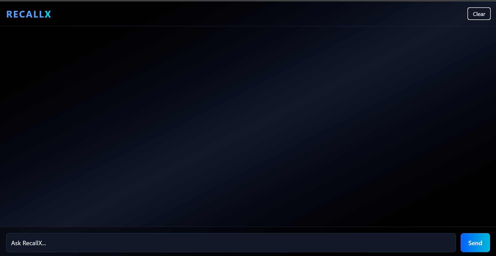
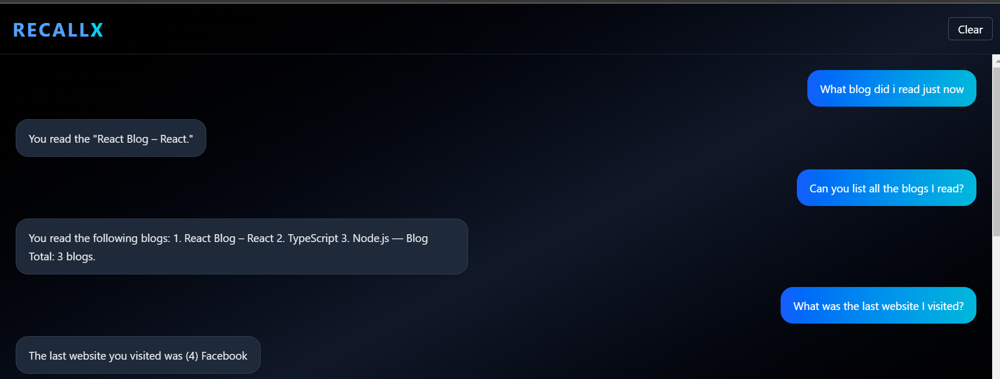
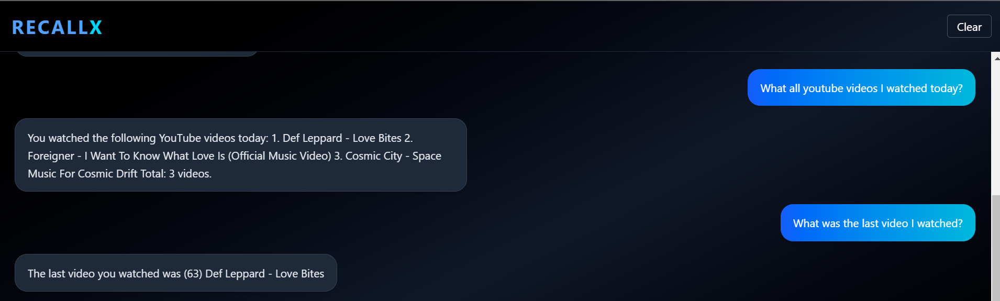
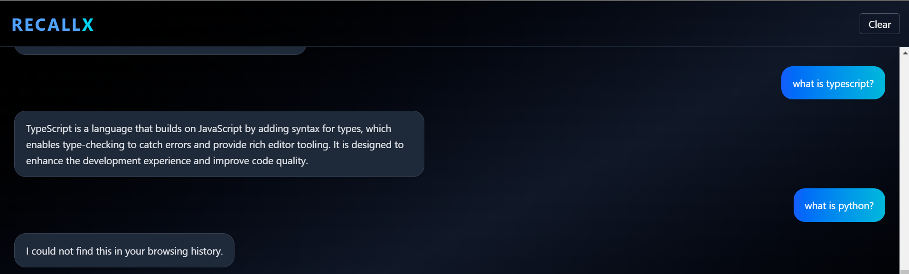

# RecallX — AI-Powered Browser Memory System

RecallX is an AI-powered system that transforms browser activity into a structured, searchable memory layer. It enables users to query their past browsing behavior using natural language.

---

## Overview

Modern browsing history is fragmented and difficult to navigate. RecallX addresses this by capturing browsing activity, processing it into meaningful representations, and allowing users to retrieve information contextually rather than through keyword search.

---

## Features

- Semantic search using vector embeddings  
- Natural language querying through an AI chatbot  
- Browser activity tracking via a Chrome extension  
- Aggregation queries (count, list, summaries)  
- Recent activity detection (last visited, last watched)  
- Time-based filtering (today, yesterday, etc.)  
- Hybrid system combining deterministic logic and AI reasoning  

---

## Demo

### Chat Interface

### Blog Retrieval and Aggregation

### Recent Video Detection

### Context-Aware Responses with Data Validation

The system answers queries based on actual browsing history and avoids generating responses when relevant data is not available, ensuring accuracy and reliability.

---

## Architecture
Browser Extension → Backend API → MongoDB
↓
Embeddings
↓
Semantic Search
↓
LLM Response

---

## Tech Stack

- Frontend: React (Vite)  
- Backend: Node.js, Express  
- Database: MongoDB  
- AI: OpenAI Embeddings + LLM  
- Extension: Chrome Extension APIs  

---

## How It Works

1. The browser extension captures user activity including URL, title, and content  
2. Data is sent to the backend and stored in MongoDB  
3. Content is converted into vector embeddings  
4. User queries are also embedded and compared using cosine similarity  
5. Relevant results are retrieved and passed to the LLM  
6. The system generates a contextual response  

---

## Setup Instructions

### 1. Clone the Repository
git clone https://github.com/your-username/recallx-ai-browser-memory.git

cd recallx-ai-browser-memory

---

### 2. Backend Setup

cd backend
npm install

Create a `.env` file:
OPENAI_API_KEY=your_key_here
MONGO_URI=your_mongodb_uri

Run backend:
node server.js

---

### 3. Frontend Setup
cd frontend
npm install
npm run dev

---

### 4. Load Extension

- Open Chrome  
- Go to `chrome://extensions/`  
- Enable Developer Mode  
- Click "Load Unpacked"  
- Select the `/extension` folder  

---

## Usage

1. Browse websites normally  
2. Open the frontend interface  
3. Ask questions like:

- What did I read today?  
- How many blogs did I read?  
- What was the last video I watched?  
- List my recent activity  

---

## Current Limitations

- Does not track user interactions like clicks or likes  
- Limited to captured page content  
- Performance depends on quality of captured data  

---

## Future Improvements

- YouTube video summarization and recommendations  
- Error tracking from local development environments  
- User interaction tracking (clicks, scrolls)  
- Improved disambiguation for vague queries  
- Personal analytics and insights  

---

## Project Status

Actively under development. Core functionality is stable and continuously being improved.

---

## Author

Shivam